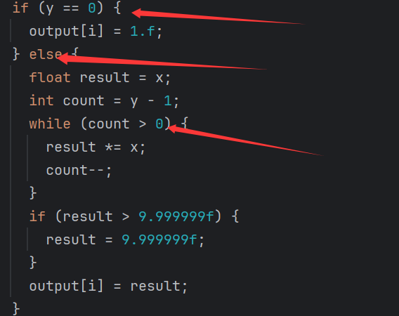
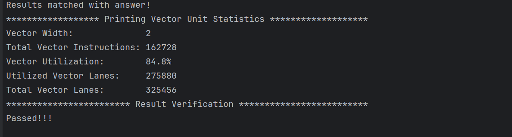
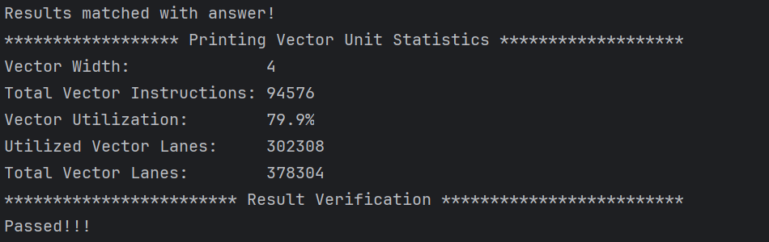
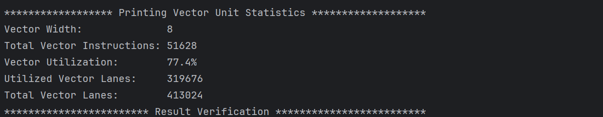
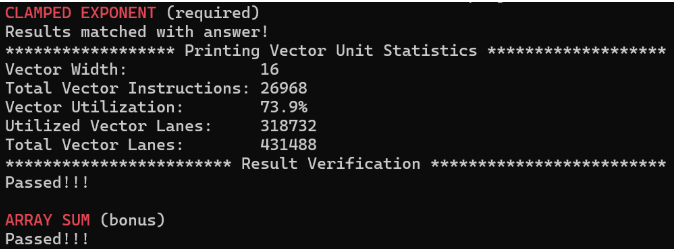

# Assgin2-Report 向量编程

## 1.掩码选择

对于向量编程，通常用掩码去选择元素；

例如分支条件，也是需要用掩码选择；

在这个代码里有三个选择，所以要用三次掩码，勿忘；

## 2.调整VECTOR WIDTH

-s 10000 即数组大小为10000个

Vector Width = 2

Vector Width = 4 

Vector Width = 8

Vector Width=16

**向量利用率（Vector Utilization）** 是指矢量指令中被实际启用的 lanes（处理单元）的比例。

- 如果 `VECTOR_WIDTH = 4`，而只有 3 个元素有效，则利用率为 3/4=75%
- 如果所有 lanes 都有效，利用率为 100%。

可见当Vector Width越大，向量利用率越小。原因分析如下：

- **分支指令的影响**：例如当向量元素为16，那么有可能有3个是符合分支条件，13个不符合分支条件，那么处理符合分支条件时有13/16的元素未被利用；**所以向量尺寸越大就更有可能导致未利用率大；**

- **尾部指令的影响：**当然这个影响比较小；尾部浪费的元素最大是VECTORWIDTH-1，所以当VECTORWIDTH越大造成的尾部指令浪费可能越大；

  