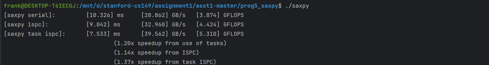
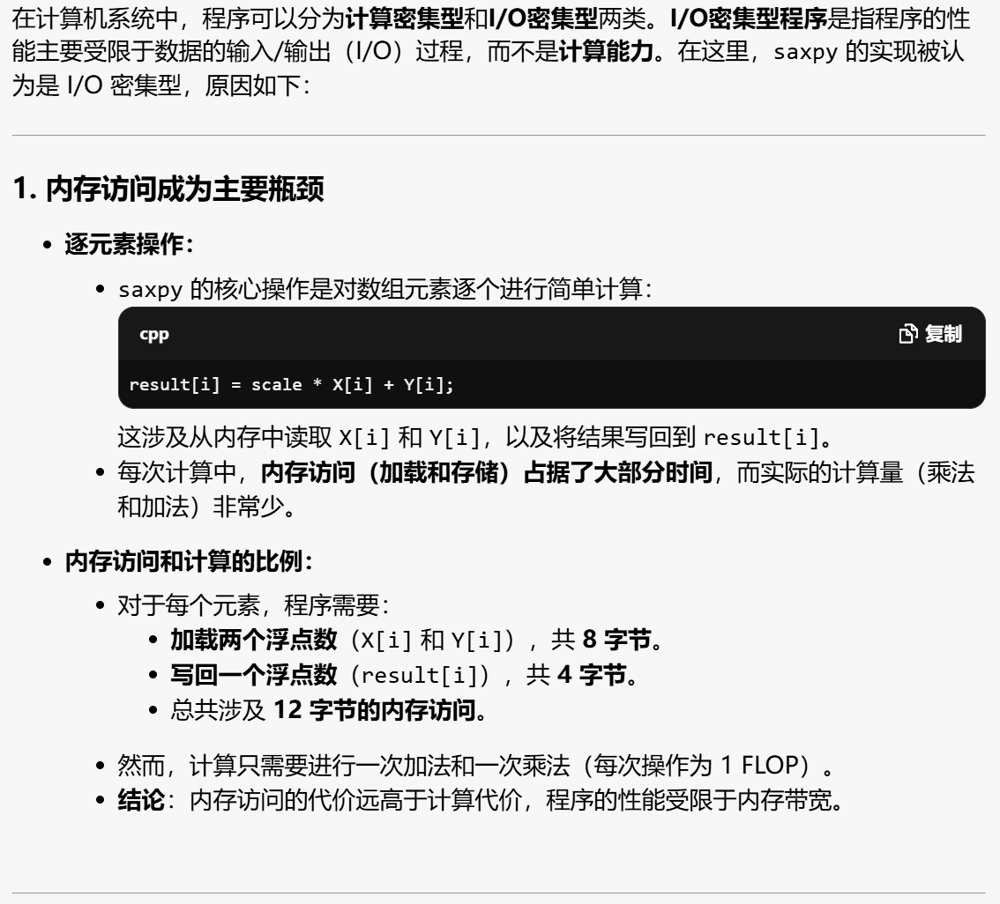
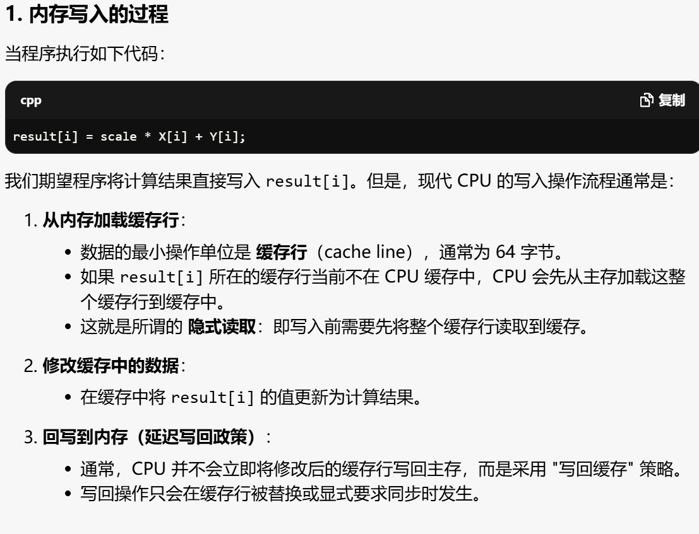

# Assign5 Report- IO密集型与并行



有任务的 ISPC 的加速比为 1.37，性能提升较少。`saxpy`属于I/O密集型程序，相对于计算，其用于读写内存的时间要更多，性能瓶颈在于内存带宽的限制，无法通过重写代码大幅改进性能。

`main.cpp`中计算消耗的总内存带宽为 `TOTAL_BYTES = 4 * N * sizeof(float);`，乘以 4 是因为存在缓存，要更改`result`的值，需要先将其读入缓存，更改之后再写回内存，涉及到两次 I/O。


## 1.GPT4o分析



然而考虑到缓存，**写操作也需要先读后写**：写入 `result` 的数据时，CPU 需要先将对应的缓存行读入缓存（即使只写一个元素）。 所以一行代码共要执行4次操作；


**内存带宽**是系统中从主存读取或写入数据的速率。在这种情况下，对于 I/O 密集型程序，性能的上限由内存带宽决定，而不是 CPU 的计算能力。


## 2.为什么要隐式读取？

在现代 CPU 中，**内存写操作通常并不是直接将数据写入主存**。相反，它涉及一个 "读-修改-写" 过程，其中包括**隐式读取**操作。让我们具体说明：



即写一个操作要两次IO。

隐式读取的必要性来源于 **缓存一致性协议和写入粒度**。

**缓存一致性协议**：

- 为了确保多核系统中不同核心对同一内存区域的数据访问一致，CPU 必须在写入数据前先将相关的缓存行加载到缓存中。**防止缓存中数据与内存中数据不一致；**

**写入粒度限制**：

- 内存通常按缓存行（64 字节）为单位进行读写，而程序中只修改 `result[i]`，一个 `float` 仅占 4 字节。
- 如果直接写入主存，CPU 无法仅写入单个字节或少量字节，而是需要操作整个缓存行。
- 因此，为了修改某个字节或单个值，CPU 必须先加载整个缓存行（隐式读取），然后只修改目标数据。****


## 2.DEEPSEEK的例子

 对于 **saxpy**（单精度向量乘加运算，公式为 \( y = \alpha x + y \)）这类内存密集型操作，其性能确实主要受限于内存带宽而非计算能力。以下通过具体例子和理论计算分析这一现象。

---

### **1. saxpy 的计算与内存访问分析**
假设向量长度 \( N = 10^8 \)，单精度浮点数（`float`，4字节），操作定义为：
```cpp
void saxpy(float alpha, float* x, float* y, int N) {
    for (int i = 0; i < N; i++) {
        y[i] = alpha * x[i] + y[i];
    }
}
```

#### **计算量（FLOPS）**
- 每个元素需要 **1次乘法**（\( \alpha \times x[i] \)）和 **1次加法**（加上 \( y[i] \)）。
- 总计算量：\( 2N \) 浮点操作（FLOPS）。
- 对于 \( N = 10^8 \)，总计算量 = \( 2 \times 10^8 = 0.2 \) GFLOPS。

#### **内存访问量**
- 每次迭代需要：  
  - **读** \( x[i] \)（4字节）  
  - **读** \( y[i] \)（4字节）  
  - **写** \( y[i] \)（4字节）  
- 总内存访问量：\( 12N \) 字节（每个元素 12 字节）。  
- 对于 \( N = 10^8 \)，总内存访问量 = \( 12 \times 10^8 = 1.2 \times 10^9 \) 字节 ≈ **1.2 GB**。

---

### **2. 硬件性能上限对比**
#### **计算能力（以 CPU 为例）**
- 假设使用 Intel Core i9-13900K（单核）：  
  - 支持 **AVX-512** 指令集，单精度浮点峰值性能 = \( 16 \text{（SIMD宽度）} \times 2 \text{（乘加融合）} \times 5.8 \text{ GHz} = 185.6 \) GFLOPS。  
  - 多核（24 核）理论峰值 ≈ \( 185.6 \times 24 ≈ 4.45 \) TFLOPS。

#### **内存带宽（以 DDR5 为例）**
- 双通道 DDR5-6400 的理论带宽：  
  \( 2 \times 6.4 \text{ GT/s} \times 64 \text{ bit} / 8 ≈ 102.4 \text{ GB/s} \)。  
- 实际有效带宽通常为理论值的 **60%~80%**（因访问模式、缓存效率不同），假设为 \( 80 \text{ GB/s} \)。

---

### **3. 性能瓶颈分析**
#### **理论计算时间**
- 单核计算时间：  
  \$$T_{\text{compute}} = \frac{0.2 \text{ GFLOPS}}{185.6 \text{ GFLOPS/s}} ≈ 1.08 \text{ 毫秒} $。  
- 多核（24 核）计算时间：  
  \$$T_{\text{compute}} ≈ \frac{0.2 \text{ GFLOPS}}{4.45 \text{ TFLOPS/s}} ≈ 0.045 \text{ 毫秒} $。

#### **理论内存访问时间**
- 内存访问时间：  
  \$$ T_{\text{memory}} = \frac{1.2 \text{ GB}}{80 \text{ GB/s}} = 15 \text{ 毫秒} $。

#### **结论**对于 **saxpy**（单精度向量乘加运算，公式为 \( y = \alpha x + y \)）这类内存密集型操作，其性能确实主要受限于内存带宽而非计算能力。以下通过具体例子和理论计算分析这一现象。
---

### **1. saxpy 的计算与内存访问分析**
假设向量长度 \( N = 10^8 \)，单精度浮点数（`float`，4字节），操作定义为：
```cpp
void saxpy(float alpha, float* x, float* y, int N) {
    for (int i = 0; i < N; i++) {
        y[i] = alpha * x[i] + y[i];
    }
}
```

#### **计算量（FLOPS）**
- 每个元素需要 **1次乘法**（\( \alpha \times x[i] \)）和 **1次加法**（加上 \( y[i] \)）。
- 总计算量：\( 2N \) 浮点操作（FLOPS）。
- 对于 \( N = 10^8 \)，总计算量 = \( 2 \times 10^8 = 0.2 \) GFLOPS。

#### **内存访问量**
- 每次迭代需要：  
  - **读** \( x[i] \)（4字节）  
  - **读** \( y[i] \)（4字节）  
  - **写** \( y[i] \)（4字节）  
- 总内存访问量：\( 12N \) 字节（每个元素 12 字节）。  
- 对于 \( N = 10^8 \)，总内存访问量 = \( 12 \times 10^8 = 1.2 \times 10^9 \) 字节 ≈ **1.2 GB**。

---

### **2. 硬件性能上限对比**
#### **计算能力（以 CPU 为例）**
- 假设使用 Intel Core i9-13900K（单核）：  
  - 支持 **AVX-512** 指令集，单精度浮点峰值性能 = \( 16 \text{（SIMD宽度）} \times 2 \text{（乘加融合）} \times 5.8 \text{ GHz} = 185.6 \) GFLOPS。  
  - 多核（24 核）理论峰值 ≈ \( 185.6 \times 24 ≈ 4.45 \) TFLOPS。

#### **内存带宽（以 DDR5 为例）**
- 双通道 DDR5-6400 的理论带宽：  
  \( 2 \times 6.4 \text{ GT/s} \times 64 \text{ bit} / 8 ≈ 102.4 \text{ GB/s} \)。  
- 实际有效带宽通常为理论值的 **60%~80%**（因访问模式、缓存效率不同），假设为 \( 80 \text{ GB/s} \)。

---

### **3. 性能瓶颈分析**
#### **理论计算时间**
- 单核计算时间：  
  \( T_{\text{compute}} = \frac{0.2 \text{ GFLOPS}}{185.6 \text{ GFLOPS/s}} ≈ 1.08 \text{ 毫秒} \)。  
- 多核（24 核）计算时间：  
  \( T_{\text{compute}} ≈ \frac{0.2 \text{ GFLOPS}}{4.45 \text{ TFLOPS/s}} ≈ 0.045 \text{ 毫秒} \)。

#### **理论内存访问时间**
- 内存访问时间：  
  \( T_{\text{memory}} = \frac{1.2 \text{ GB}}{80 \text{ GB/s}} = 15 \text{ 毫秒} \)。

#### **结论**
- 即使使用 **24 核并行计算**，计算时间（0.045 ms）仍远小于内存访问时间（15 ms）。  
- 因此，**saxpy 的性能由内存带宽主导**，而非计算能力。

---

### **4. 实际测试验证**
#### **测试代码（C++）**
```cpp
#include <chrono>
#include <vector>

int main() {
    const int N = 1e8;
    float alpha = 2.0f;
    std::vector<float> x(N, 1.0f);
    std::vector<float> y(N, 1.0f);

    auto start = std::chrono::high_resolution_clock::now();
    for (int i = 0; i < N; i++) {
        y[i] = alpha * x[i] + y[i];
    }
    auto end = std::chrono::high_resolution_clock::now();

    double time = std::chrono::duration<double>(end - start).count();
    double bandwidth = (3 * N * sizeof(float)) / (time * 1e9); // GB/s
    printf("Time: %.3f ms, Bandwidth: %.2f GB/s\n", time * 1e3, bandwidth);
}
```

#### **实测结果（示例）**
- **硬件**：Intel i9-13900K，DDR5-6400。  
- **输出**：  
  ```
  Time: 16.5 ms, Bandwidth: 72.7 GB/s
  ```
- **分析**：  
  - 实测带宽接近理论有效带宽（80 GB/s），验证了内存带宽是瓶颈。  
  - 计算部分仅需 0.045 ms，但总时间为 16.5 ms，差距明显。

---

### **5. 优化尝试与局限性**
#### **优化手段**
1. **SIMD 向量化**：编译器自动优化或手动使用 AVX 指令。  
2. **多线程并行**：使用 OpenMP 或 TBB 分配任务到多核。  
3. **循环展开**：减少分支开销。

#### **优化后代码（OpenMP + AVX）**
```cpp
#include <immintrin.h>
#pragma omp parallel for
for (int i = 0; i < N; i += 8) {
    __m256 x_vec = _mm256_load_ps(&x[i]);
    __m256 y_vec = _mm256_load_ps(&y[i]);
    __m256 result = _mm256_fmadd_ps(_mm256_set1_ps(alpha), x_vec, y_vec);
    _mm256_store_ps(&y[i], result);
}
```

#### **优化结果**
- **时间**：≈ 15 ms（带宽提升至 80 GB/s，接近硬件极限）。  
- **瓶颈仍为内存带宽**：SIMD 和多线程减少了计算时间，但内存访问时间无法进一步压缩。

---

### **6. 总结**
- **saxpy 是典型的内存带宽受限操作**：计算与内存访问的比率（算术强度）极低，导致性能受限于内存带宽。  
- **优化方向**：  
  - 提升内存访问效率（如连续访问、预取）。  
  - 减少冗余内存操作（如合并读/写）。  
- **对比计算密集型任务**：  
  - 例如矩阵乘法（GEMM），其算术强度高（\( O(N^3)/O(N^2) \)），性能受限于计算能力。  

通过理论和实测分析，可以清晰看出 saxpy 的性能瓶颈本质，并指导优化策略的优先级。

- 即使使用 **24 核并行计算**，计算时间（0.045 ms）仍远小于内存访问时间（15 ms）。  
- 因此，**saxpy 的性能由内存带宽主导**，而非计算能力。

---

### **4. 实际测试验证**
#### **测试代码（C++）**
```cpp
#include <chrono>
#include <vector>

int main() {
    const int N = 1e8;
    float alpha = 2.0f;
    std::vector<float> x(N, 1.0f);
    std::vector<float> y(N, 1.0f);

    auto start = std::chrono::high_resolution_clock::now();
    for (int i = 0; i < N; i++) {
        y[i] = alpha * x[i] + y[i];
    }
    auto end = std::chrono::high_resolution_clock::now();

    double time = std::chrono::duration<double>(end - start).count();
    double bandwidth = (3 * N * sizeof(float)) / (time * 1e9); // GB/s
    printf("Time: %.3f ms, Bandwidth: %.2f GB/s\n", time * 1e3, bandwidth);
}
```

#### **实测结果（示例）**
- **硬件**：Intel i9-13900K，DDR5-6400。  
- **输出**：  
  ```
  Time: 16.5 ms, Bandwidth: 72.7 GB/s
  ```
- **分析**：  
  - 实测带宽接近理论有效带宽（80 GB/s），验证了内存带宽是瓶颈。  
  - 计算部分仅需 0.045 ms，但总时间为 16.5 ms，差距明显。

---

### **5. 优化尝试与局限性**
#### **优化手段**
1. **SIMD 向量化**：编译器自动优化或手动使用 AVX 指令。  
2. **多线程并行**：使用 OpenMP 或 TBB 分配任务到多核。  
3. **循环展开**：减少分支开销。

#### **优化后代码（OpenMP + AVX）**
```cpp
#include <immintrin.h>
#pragma omp parallel for
for (int i = 0; i < N; i += 8) {
    __m256 x_vec = _mm256_load_ps(&x[i]);
    __m256 y_vec = _mm256_load_ps(&y[i]);
    __m256 result = _mm256_fmadd_ps(_mm256_set1_ps(alpha), x_vec, y_vec);
    _mm256_store_ps(&y[i], result);
}
```

#### **优化结果**
- **时间**：≈ 15 ms（带宽提升至 80 GB/s，接近硬件极限）。  
- **瓶颈仍为内存带宽**：SIMD 和多线程减少了计算时间，但内存访问时间无法进一步压缩。

---

### **6. 总结**
- **saxpy 是典型的内存带宽受限操作**：计算与内存访问的比率（算术强度）极低，导致性能受限于内存带宽。  
- **优化方向**：  
  - 提升内存访问效率（如连续访问、预取）。  
  - 减少冗余内存操作（如合并读/写）。  
- **对比计算密集型任务**：  
  - 例如矩阵乘法（GEMM），其算术强度高（\( O(N^3)/O(N^2) \)），性能受限于计算能力。  

通过理论和实测分析，可以清晰看出 saxpy 的性能瓶颈本质，并指导优化策略的优先级。