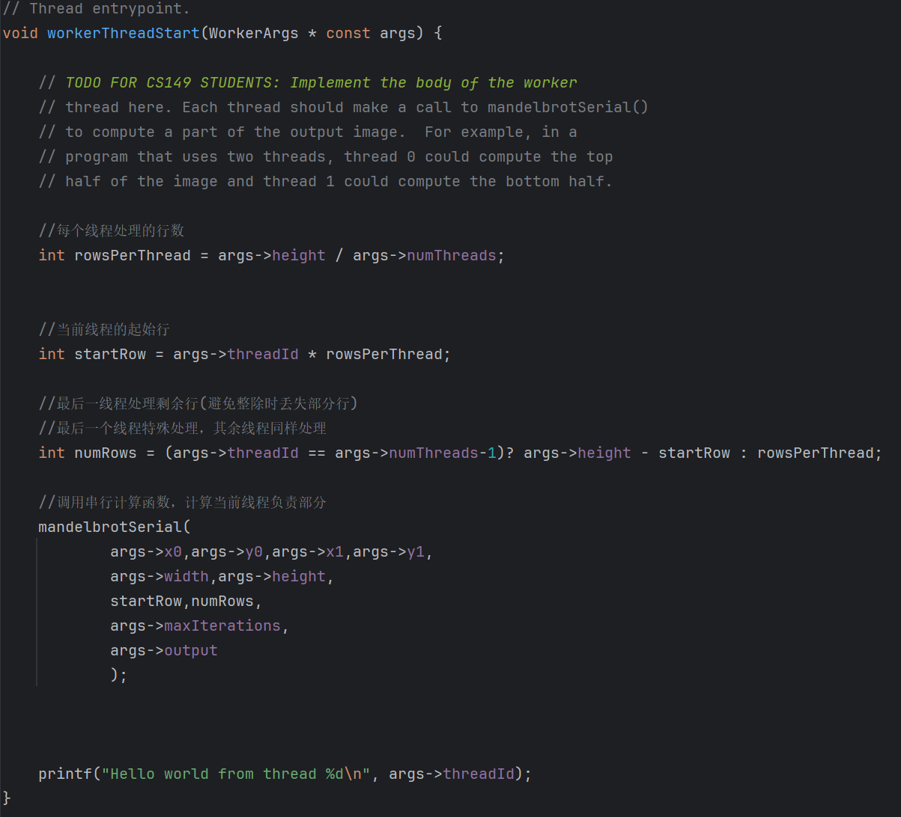
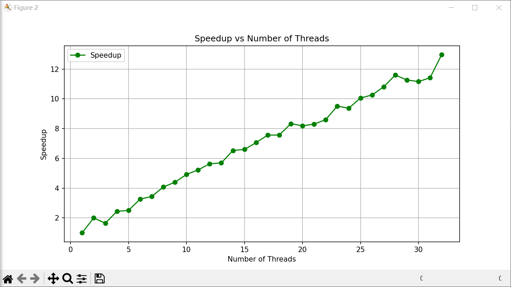
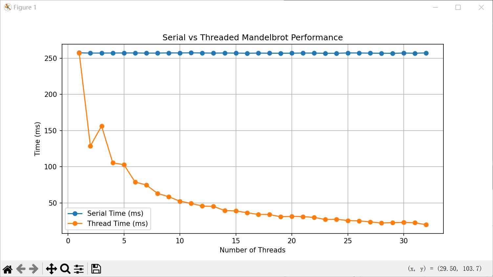
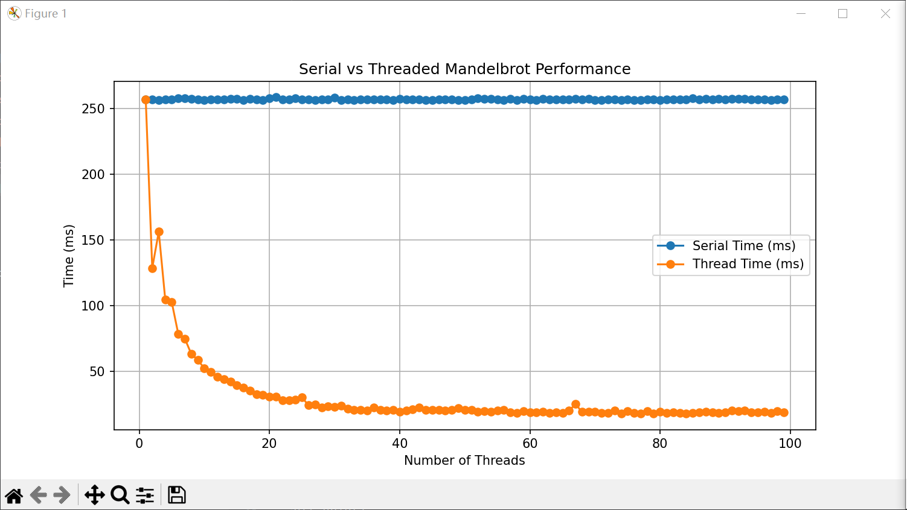
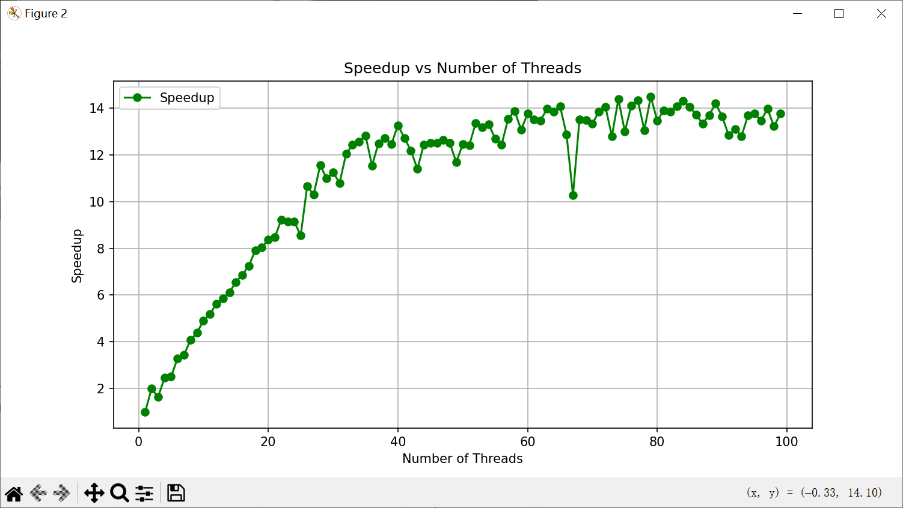

# Assign1-Report

### 1.补全代码：

使得每个线程分别处理一段时间

### 2.结果分析:

## 疑问

## 1.为什么在 3 个线程时加速比反而下降？

整个图像View1在中间的部分是计算量最多的。而Thread1计算相对更多，Thread0和Thread2任务相对轻松，**若不均匀分配任务，那么整个任务完成时取决于最慢的线程。** 

那么，当两个线程的情况时，由于均匀分配任务，最慢的线程任务量假设是x

三个线程的情况下，最慢的任务是y.  y>x导致3个线程加速比下降；

## 2.20线程之前均匀上升，20线程之后波动现象

**20线程之前：** 加速比具有参考价值，因为硬件资源未饱和，性能表现稳定且可预测。

**20线程之后：** 加速比受硬件限制和操作系统调度影响，波动较大，参考价值有限。

## 20线程后为什么波动较大？

首先，该计算任务具有特点：**曼德布罗特集的计算复杂度并不均匀，不同区域的像素点需要不同的迭代次数才能确定结果。**

当线程数较少时（如 20 线程），每个线程负责的任务量较大，任务分配的不均衡性会更加显著。最慢线程完成的时间决定了整体的任务时间，因此加速比可能偏低。

当线程数增加（如超过 20），每个线程的任务粒度变小，任务分配越趋于均匀化，这种不均衡性会被削弱，导致性能提升趋于平稳。

也就是说在20线程之后影响该程序性能的原因有两个：**任务量粒度，切换上下文**

所以，可以见到当（20~某个数x）任务量粒度带来的性能优化大于切换上下文。但当(x~y (y可能趋近于100之后的数)) 任务量粒度都趋于均匀从而其带来的影响小于切换上下文开销。

解释一下什么叫做计算复杂度不均匀的任务：

这个图中按道理我们是按线程数量从高度上均匀分布。但是Thread0线程任务量=Thread2线程任务量<Thread1线程任务量；这就是任务不均匀；

## 总结

- 并行程序的时间（性能）由最慢的线程（最重的任务）决定；
- **假设任务按线程数量均分任务。**在计算型程序中，对于计算复杂度不均匀的任务，很有可能任务粒度也会影响程序性能；即存在**任务量粒度，切换上下文**两个因素影响性能；
- **假设任务按线程数量均分任务。假设线程超过逻辑核。**存在一个阈值g,使得当x< g时任务量粒度带来的优化大于切换上下文【**任务粒度优化占主导**】；x>g时任务量粒度趋于均匀，这时任务量粒度带来的优化小于切换上下文【**任务粒度不再重要，开销占主导**】。 
- 当线程小于等于逻辑核时，性能变化均匀；  当线程大于逻辑核时，对于某些特定的任务（例如计算复杂度不均匀的任务），性能仍可以继续优化。