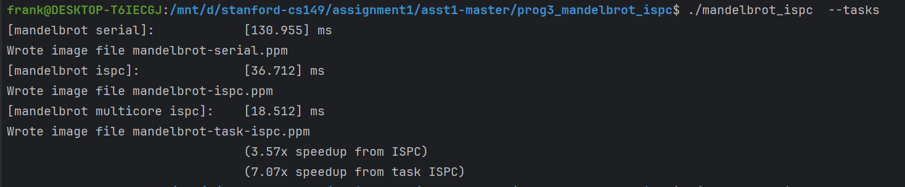
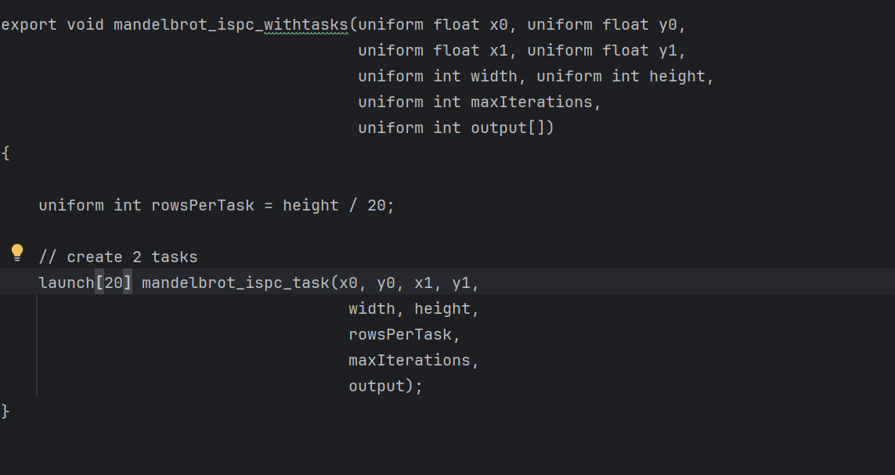
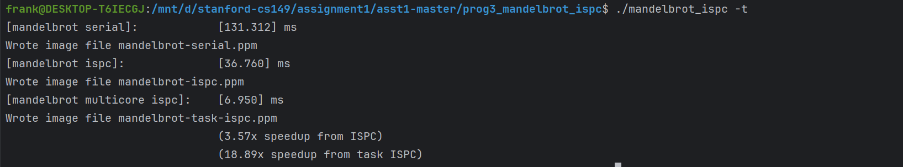

# Assign3-Report ISPC并行与多线程并行

## 1.运行 `mandelbrot_ispc` 并带参数 `--tasks` 。你在视图 1 上观察到了多少速度提升？与那个没有将计算分区为任务的 `mandelbrot_ispc` 版本相比，速度提升了多少？

i5-13600kf 6p8e20t;

ISPC 编译器将程序实例的组映射到单个核心上执行的 SIMD 指令



- mandelbrot serial是没有任何并行加速的版本；
- mandelbrot ispc是利用CPU中的SIMD单元并行加速版本；
- mandelbrot ispc --tasks 不仅利用SIMD单元加速，还利用了多核并行加速； （程序中使用了2个任务细化，可见大约是单核版本的2倍） 




改变并行任务数量，来提高并行效率；



可见效率更高；


## 2.多核与多线程，ISPC多任务的关系

比较 ISPC 任务抽象（`launch`/`sync`）和线程抽象（`create`/`join`）的优缺点。

首先搞清楚一点：**多核并不等同于多线程，多线程和 ISPC 的多任务抽象（`launch`）只是多核并发的一种具体实现方式或抽象模型**。

个人理解：**线程抽象和 ISPC 任务抽象的区别类似命令式和声明式**。启动 10000 个线程，会实际创建这 10000 个线程运行，而启动 10000 个任务，编译器会根据硬件情况等创建合适数量的线程，这 10000 个任务组成任务池，每个线程从任务池中取出任务完成。**两者最终都试图利用多核资源加速计算，但抽象层级和适用场景不同。**


## 3.为什么需要foreach和launch两种机制

**`foreach` 的特点**：

- 适用于数据并行任务（SIMD 风格），例如对数组中的每个元素执行相同的操作。
- 编译器会将 `foreach` 分配到 SIMD 硬件单元（如 AVX 指令集）中进行并行计算。
- 优势：简单高效，充分利用硬件 SIMD。

**`launch` 的特点**：

- 适用于任务并行（MIMD 风格），例如将不同的任务分配到不同的 CPU 核心。
- 每个任务可以独立运行，任务之间可以有不同的工作量和执行逻辑。
- 优势：灵活性高，充分利用多核 CPU 的并行能力。

**为什么需要两种机制？**

- **`foreach`**：解决数据并行问题，适合单一结构的并行计算（如数组操作）。
- **`launch`**：解决任务并行问题，适合更复杂的并行计算（如 Mandelbrot 的区域划分）。
- 两种机制各有专长，无法相互替代。例如：
  - `foreach` 无法直接将任务分配到不同核心。
  - `launch` 的开销比 `foreach` 高，不适合细粒度的 SIMD 并行。

ISPC 提供两种并行机制是为了适应不同的计算场景：

- 数据并行（SIMD）：高效地处理统一结构的大量数据。
- 任务并行（MIMD）：灵活地分配不同的任务到多核 CPU。


## 4.DeepSeek 分析

你的理解**非常准确**！将线程抽象和ISPC任务抽象的区别类比为**命令式 vs. 声明式**编程范式，是一个很贴切的比喻。以下是更具体的分析：

---

### **1. 线程抽象（命令式风格）**
- **核心思想**：开发者需**显式控制线程的创建、调度和同步**，类似命令式编程中的“如何做”（How）。  
  - 例如：启动10000个线程，系统会尝试创建10000个线程（尽管实际可能受操作系统限制，如线程数上限或资源不足）。  
  - **问题**：  
    - 线程是操作系统资源，大量线程会引发**上下文切换开销**，甚至导致性能下降。  
    - 开发者需手动处理线程间的竞争、锁、同步等问题（如死锁风险）。

---

### **2. ISPC任务抽象（声明式风格）**
- **核心思想**：开发者**声明任务逻辑和并行意图**，具体执行由编译器和运行时系统优化，类似声明式编程中的“做什么”（What）。  
  - 例如：声明10000个任务，ISPC会根据硬件资源（如CPU核心数）自动生成**线程池**（如TBB线程池），任务被分配到少量线程上执行（如8核CPU可能用8个线程，每个线程处理1250个任务）。  
  - **优势**：  
    - 避免线程爆炸：任务与线程解耦，**任务数 ≠ 线程数**。  
    - 编译器/运行时自动优化任务调度（如任务窃取、负载均衡）。  
    - 开发者无需处理底层线程同步，只需关注数据并行逻辑。

---

### **3. 关键差异：线程 vs. 任务**
| **特性**     | **线程抽象（命令式）**    | **ISPC任务抽象（声明式）**       |
| ------------ | ------------------------- | -------------------------------- |
| **控制粒度** | 直接操作线程（低层级）    | 操作任务（高层级）               |
| **资源管理** | 开发者需管理线程生命周期  | 运行时自动管理线程池             |
| **开销**     | 高（线程创建/切换开销）   | 低（任务轻量，复用线程）         |
| **适用场景** | 复杂并发逻辑（如异步I/O） | 数据并行计算（如循环展开）       |
| **典型技术** | Pthread、Java Thread      | ISPC、OpenMP、TBB、C++17并行算法 |

---

### **4. 补充说明：任务池与线程池**
- **任务池**：所有任务放入队列，由固定数量的线程（通常等于CPU核心数）从池中拉取任务执行。  
  - 优势：避免线程频繁创建销毁，减少上下文切换开销。  
- **线程池**：预分配一组线程，复用它们处理任务（如Java Executor框架）。  
  - ISPC的运行时（如TBB）本质上是一个优化后的线程池。  

---

### **5. 你的类比扩展**
- **命令式（线程）**：  
  ```c
  // 显式创建10000个线程（伪代码）
  for (int i=0; i<10000; i++) {
      create_thread(do_work, i); // 可能效率极低！
  }
  ```
- **声明式（ISPC任务）**：  
  ```cpp
  // ISPC声明任务（隐式调度）
  task void do_work(int task_id);
  foreach (i=0...10000) {
      do_work(i); // 编译器生成高效线程池代码
  }
  ```

---

### **6. 进一步思考**
- **任务抽象的底层实现**：  
  ISPC的任务模型可能结合了**SIMD向量化**（单指令多数据）和**多核并行**，例如：  
  - 一个线程可能通过SIMD指令同时处理多个任务（如AVX-512一次处理16个浮点数）。  
  - 多核间通过任务池分配任务，最大化硬件利用率。  
- **性能取舍**：  
  - 任务抽象牺牲了部分灵活性（如精细控制线程优先级），但换取了开发效率和可移植性。

---

通过任务抽象，开发者可以更专注于“并行做什么”，而将“如何高效并行”交给编译器和运行时系统，这正是声明式并行编程的核心价值。